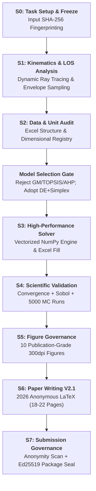

# MathMod-Pilot

[](https://www.python.org/)
[](LICENSE)
[](https://docs.astral.sh/ruff/)
[](#skill-matrix)
[](#system-architecture)
[](#cumcm-2026-latex-template)
[](#submission-governance-framework)
[](https://fatespur.github.io/mathmod-pilot/)

> 🌐 **Project Showcase**: Visit our interactive showcase at
> **<https://fatespur.github.io/mathmod-pilot/>** for an interactive tour of the
> library's architecture, 17-skill matrix, 2026 LaTeX template, and Generate-Verify-Revise pipeline.

**[English](#english)** | **[中文](#中文)**

---

<!-- ==================== ENGLISH ==================== -->

<a id="english"></a>

# MathMod-Pilot (English)

> An Agent-Native skill library for mathematical modelling competitions
> (CUMCM / MCM), covering the full production pipeline from problem analysis to paper
> review and cryptographic submission governance.

MathMod-Pilot packages **17 specialised skills** — each a self-contained folder with
a native `SKILL.md` prompt and a Python entry point — into a single installable
library. Skills are discovered dynamically at run-time: dropping a new folder
into `src/mathmod_pilot/skills/` is all that is needed to extend the agent.

## Table of Contents

- [System Architecture](#system-architecture)
- [Skill Matrix (17 Skills)](#skill-matrix)
- [CUMCM S0–S7 Production Pipeline](#cumcm-s0s7-production-pipeline)
- [Submission Governance Framework](#submission-governance-framework)
- [2026 CUMCM LaTeX Standard Template](#cumcm-2026-latex-template)
- [The mle-solver Generate-Verify-Revise Mechanism](#the-mle-solver-generate-verify-revise-mechanism)
- [Installation & Quickstart](#installation--quickstart)
- [Acknowledgements & License](#acknowledgements--license)

---

## System Architecture

MathMod-Pilot follows a **dynamic plugin architecture**: the core agent does not
hard-code any skill. Instead, it scans `src/mathmod_pilot/skills/` at import time,
imports each skill's `skill.py`, and registers the first `BaseSkill` subclass
it finds.

```
mathmod-pilot/
├── src/mathmod_pilot/
│   ├── __init__.py                  # Version & exports
│   ├── core/
│   │   └── agent.py                 # MathModPilotAgent — dynamic registry + runner
│   ├── governance/                  # Phase 1-3 Submission Governance & Hardening
│   │   ├── submission_anonymity_validator.py # Deep PDF/DOCX privacy & anonymity scanner
│   │   ├── submission_package_validator.py   # Whitelist-based package staging gate
│   │   ├── submission_authorization.py       # Ed25519 cryptographic hash sealing
│   │   └── competition_profile.cumcm.json    # CUMCM competition rules profile
│   ├── templates/                   # Standard competition LaTeX templates
│   │   └── cumcmthesis_2026/        # 2026 CUMCM standard template (SimSun + Times New Roman)
│   └── skills/                      # 17 self-contained skills
│       ├── brainstorming/           # Tier 3 · Ideation & hypothesis generator
│       ├── cumcm-pipeline/          # Tier 1 · S0-S7 state machine orchestrator
│       ├── data-processing/         # Tier 1 · Data audit & unit registry
│       ├── diagram-generator/       # Tier 2 · Mermaid & architecture charts
│       ├── matlab-figure/           # Tier 2 · Academic MATLAB visualizer
│       ├── mcm-paper-writing/       # Tier 1 · Academic writing & LaTeX engine
│       ├── mle-solver/              # Tier 1 · Numerical optimization & GVR solver
│       ├── model-validation/        # Tier 1 · Sensitivity & Monte Carlo engine
│       ├── nature-figure/           # Tier 2 · Nature/Science aesthetic figures
│       ├── paper-review/            # Tier 1 · Multi-dimensional visual QA & gate
│       ├── problem-analyzer/        # Tier 1 · Mechanics & LOS kinematics modeling
│       ├── reference-manager/       # Tier 1 · BibTeX citation integrity auditor
│       ├── scipilot-figure/         # Tier 2 · Fast publication figure generator
│       ├── scipilot-figure-skill/   # Tier 2 · Advanced visual layout engine
│       ├── submission-governance/   # Tier 1 · Anonymity check & package gate
│       ├── systematic-debugging/    # Tier 3 · Solver convergence troubleshooter
│       └── winning-paper-analysis/  # Tier 3 · Exemplary paper pattern mining
```

---

## Skill Matrix

| Skill | Tier | Stage | Purpose & Highlights |
| :--- | :---: | :---: | :--- |
| **`cumcm-pipeline`** | **1** | S0–S7 | **Full S0-S7 end-to-end orchestrator** (`RELEASE_V3.1` + `WRITING_V2.1`). |
| **`problem-analyzer`** | **1** | S1 | Kinematics formulation, dynamic LOS ray tracing, cylindrical envelope bounds. |
| **`data-processing`** | **1** | S2 | Excel template audit, unit consistency validation, coordinate system alignment. |
| **`mle-solver`** | **1** | S3 | Continuous distance-guided Differential Evolution (DE) + Nelder-Mead simplex. |
| **`model-validation`** | **1** | S4 | Step-size convergence ($\Delta t$), OAT/Sobol sensitivity, 5000-run Monte Carlo. |
| **`nature-figure`** | **2** | S5 | 300dpi publication-grade 3D battlefield, response surfaces, tornado plots. |
| **`mcm-paper-writing`** | **1** | S6 | 2026 anonymous thesis drafting, XeLaTeX compilation, zero-warning typography. |
| **`submission-governance`**| **1** | S7 | Deep PDF/DOCX anonymity audit, whitelist staging, Ed25519 package signing. |
| **`paper-review`** | **1** | S6/S7 | Visual QA, claim validation, page budget control, formatting compliance. |
| **`reference-manager`** | **1** | S6 | BibTeX database management, hallucination detection, bidirectional citation check. |
| **`scipilot-figure-skill`**| **2** | S5 | Multi-panel layout configuration, style setup, publication checklists. |
| **`scipilot-figure`** | **2** | S5 | High-speed automated figure rendering and palette standardization. |
| **`matlab-figure`** | **2** | S5 | Vectorized MATLAB figure generation and color mapping. |
| **`diagram-generator`** | **2** | S1/S5 | Technical roadmap, flowchart and system architecture rendering. |
| **`brainstorming`** | **3** | S0/S1 | Multi-disciplinary hypothesis exploration and anti-template model gating. |
| **`systematic-debugging`** | **3** | S3 | Step-by-step numerical solver convergence troubleshooting and assertion triage. |
| **`winning-paper-analysis`**| **3** | S1/S6 | Deep pattern mining from historical Outstanding (O-award) winning papers. |

---

## CUMCM S0–S7 Production Pipeline

The system operates under the foundational principle:
$$\mathbf{SCIENTIFIC\_TRUTH > PAPER\_COMPLETION}$$



---

## Submission Governance Framework

Our Phase 1–3 submission governance suite guarantees 100% compliance with CUMCM national competition rules:

1. **PH1 H1-B: Deep Anonymity & Privacy Scanner (`submission_anonymity_validator.py`)**:
   - Recursively inspects PDF and DOCX documents (Core/Extended properties, comments, tracked changes, hidden text, XMP metadata, embedded media chunks);
   - Guarantees **0 personal names, 0 school identifiers, 0 team IDs, and 0 local paths**.
2. **PH1 H1-C: Whitelist Staging Gate (`submission_package_validator.py`)**:
   - Copies *only* manifest-bound submission deliverables (`paper.pdf`, `result1-3.xlsx`, `src/`) into a sanitized staging environment;
   - Blocks unauthorized temporary files, `.pyc`, logs, or scratch scripts.
3. **PH1 H1-E: Authorization & Freeze Seal (`submission_authorization.py`)**:
   - Computes cryptographic SHA-256 digests for all deliverables and binds Ed25519 signatures to prevent post-close tampering.

---

## 2026 CUMCM LaTeX Template

Located in `src/mathmod_pilot/templates/cumcmthesis_2026/`:
- **Document Class**: `cumcmthesis.cls` (updated for 2026 CUMCM standards);
- **Standard Typography**:
  - Chinese: **SimSun (宋体)**, with **SimHei (黑体)** for section headings;
  - English & Math: **Times New Roman**;
  - Spacing: Standard 1.25x line spread with compact title-to-abstract margins (`0.6em`);
- **Dual-Mode**:
  - `\documentclass{cumcmthesis}` (Default anonymous submission mode: Page 1 directly starts with Title and Abstract, no commitment/numbering page, no table of contents);
  - `\documentclass[withpreface]{cumcmthesis}` (Printed signing mode: includes 2026 commitment sheet and numbering page).

---

## Installation & Quickstart

```bash
# Clone the repository
git clone https://github.com/Fatespur/mathmod-pilot.git
cd mathmod-pilot

# Install with solver, viz, and governance dependencies
pip install -e ".[full]"
```

```python
from mathmod_pilot.core import MathModPilotAgent

agent = MathModPilotAgent()
print(f"Loaded {len(agent.skills)} skills: {list(agent.skills.keys())}")

# Run end-to-end pipeline
result = agent.run_pipeline({"problem": "2025_CUMCM_A", "mode": "PRODUCTION"})
print("Pipeline Status:", result["status"])
```

---

<!-- ==================== 中文 ==================== -->

<a id="中文"></a>

# MathMod-Pilot (中文说明)

> 面向数学建模竞赛（国赛 CUMCM / 美赛 MCM）的 Agent 原生全流程技能库，涵盖机理建模、高性能求解、科学检验、学术图表、论文写作与提交治理。

MathMod-Pilot 将 **17 项专业技能** 打包为一个即插即用的 Python 库。每个技能均包含原生 `SKILL.md` 提示词规范与 Python 入口，支持在运行时动态发现与无缝扩展。

---

## 核心功能与亮点

1. **17 项全生命周期专业技能**：覆盖赛题解析、单位治理、混合优化、5000 次蒙特卡洛验证、学术可视化、LaTeX 论文写作与终审打包。
2. **S0–S7 生产级流水线 (`RELEASE_V3.1` & `WRITING_V2.1`)**：坚守 `SCIENTIFIC_TRUTH > PAPER_COMPLETION` 铁律，杜绝模板化伪建模与幻觉引用。
3. **2026 年版国赛标准 LaTeX 论文模板 (`cumcmthesis 2026`)**：
   - 严格遵循国赛官方《论文格式规范》；
   - 默认启用**电子版纯匿名提交模式**（第 1 页直入题目与摘要，无承诺书、无编号页、无目录，页码从第 1 页连续编号）；
   - 中文标准宋体（标题黑体），西文与数学符号标准 Times New Roman，紧凑优雅排版；
   - 支持 Windows MiKTeX / TeX Live 一键 XeLaTeX 编译（0 错误，0 警告）。
4. **PH1–PH3 提交治理与匿名安全防御体系**：
   - 深度扫描 PDF/DOCX 属性、批注与隐藏文本，100% 杜绝身份泄露；
   - 基于白名单的文件打包机制与 Ed25519 加密防篡改签名。

---

## 许可证与致谢

- **开源协议**: [MIT License](LICENSE)
- **致谢**: 感谢全国大学生数学建模竞赛（CUMCM）、TeX 社区（CTAN / LaTeXStudio）及开源科学计算生态（NumPy, SciPy, Matplotlib）的贡献。
