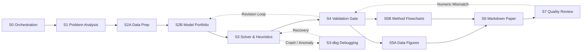

# CUMCM Modeling Skills Toolkit

[](LICENSE)
[](pyproject.toml)
[](registry/skills.json)
[](registry/workflow.json)
[](#)

> **Agent-Native Mathematical Modeling Toolkit for CUMCM & MCM/ICM Competitions**  
> *From Problem Understanding → Data Engineering → Model Selection → Solver Execution → Independent Validation → Publication Visualization → Standardized Markdown Writing → Quality Review.*

[中文文档 (README_zh-CN.md)](README_zh-CN.md) | [Architecture](docs/architecture.md) | [Workflow & Gates](docs/workflow.md) | [Skill Map](docs/skill-map.md) | [Usage Guide](docs/usage.md)

---

## Overview

The **CUMCM Modeling Skills Toolkit** is an open-source, modular, agent-native framework designed specifically for mathematical modeling competitions (such as China Undergraduate Mathematical Contest in Modeling - CUMCM, and MCM/ICM).

Unlike generic prompts or monolithic scripts, this toolkit is structured around **deterministic state machines and strict artifact contracts**, providing:
- **15 Production-Grade Skills** covering the complete competition lifecycle from initial problem parsing to final submission packaging.
- **Anti-Template Screening**: Strict evaluation mechanisms to prevent hallucinated or formulaic model choices.
- **Independent Validation Gate**: Rigorous sensitivity, robustness, and baseline superiority checks before paper drafting.
- **Academic Flowchart Engine**: Automated generation of dual-stream, swimlane, and cyclic framework diagrams in draw.io, SVG, and high-resolution PNG.
- **Markdown-Only Paper Pipeline**: Native OMML formula compatibility, Word generation, zero-table-of-contents enforcement, and strict anonymity compliance.

---

## Modeling Workflow Lifecycle



---

## Packaged Skill Catalog

| Stage | Category | Skill | Core Function |
| :---: | :--- | :--- | :--- |
| **S0** | `09-orchestration` | [`modeling-workflow-orchestrator`](skills/09-orchestration/modeling-workflow-orchestrator/) | State-machine workflow coordinator, DAG invalidation, and execution receipts. |
| **S1** | `01-problem-understanding` | [`problem-analyzer`](skills/01-problem-understanding/problem-analyzer/) | Formal problem parsing, mathematical abstraction, variable/unit binding, and physical assertions. |
| **S2A** | `02-data-analysis` | [`data-processing`](skills/02-data-analysis/data-processing/) | Multi-source competition data ingestion, outlier treatment, and leakage-safe feature engineering. |
| **S2B** | `03-model-formulation` | [`model-selection`](skills/03-model-formulation/model-selection/) | Anti-template model selection, baseline/primary/alternative portfolio design, and identifiability. |
| **S3** | `04-algorithms-and-solving` | [`mle-solver`](skills/04-algorithms-and-solving/mle-solver/) | Mathematical equation mapping, numerical solvers, and heuristic algorithms (GA/PSO/SA). |
| **S3-dbg** | `04-algorithms-and-solving` | [`systematic-debugging`](skills/04-algorithms-and-solving/systematic-debugging/) | Domain-specific error recovery: physical inconsistencies, econometric anti-patterns, and solver crashes. |
| **S4** | `05-validation` | [`model-validation`](skills/05-validation/model-validation/) | Independent release gate: preregistered validation plan, sensitivity analysis, and robustness testing. |
| **S5A** | `06-visualization` | [`scipilot-figure-cumcm`](skills/06-visualization/scipilot-figure-cumcm/) | Claim-to-figure visual planning, publication styling, and misleading chart prevention. |
| **S5A** | `06-visualization` | [`scipilot-figure-skill`](skills/06-visualization/scipilot-figure-skill/) | Scientific plotting engine: Matplotlib/Seaborn palettes, visual QA, and vector exports. |
| **S5A** | `06-visualization` | [`matlab-figure`](skills/06-visualization/matlab-figure/) | MATLAB-native 3D surface (surf/mesh), vector field (quiver), and Parula colormap generation. |
| **S5B** | `06-visualization` | [`cumcm-academic-flowchart`](skills/06-visualization/cumcm-academic-flowchart/) | Academic methodology framework diagram generator (draw.io, native SVG, transparent PNG). |
| **S6** | `07-writing` | [`mcm-paper-writing`](skills/07-writing/mcm-paper-writing/) | Strict Markdown-only writing pipeline with OMML formula compatibility and page budgeting. |
| **PH2** | `07-writing` | [`reference-manager`](skills/07-writing/reference-manager/) | GB/T 7714 reference normalization, DOI verification, and bidirectional citation consistency. |
| **S7** | `08-quality-assurance` | [`paper-review`](skills/08-quality-assurance/paper-review/) | End-to-end evidence tracing, numerical macro consistency audit, and anonymity verification. |
| **Bench** | `08-quality-assurance` | [`winning-paper-analysis`](skills/08-quality-assurance/winning-paper-analysis/) | Historical winning paper structure analysis, section density budgeting, and writing patterns. |

---

## Quick Start

### 1. Installation

```bash
# Clone the repository
git clone https://github.com/Fatespur/mathmod-pilot
cd mathmod-pilot

# Install dependencies
pip install -r requirements.txt
```

### 2. Using with AI Coding Assistants & Agents
All skills feature standardized `SKILL.md` instructions with YAML frontmatter. Point your AI agent to `./skills` or invoke them by name:
```markdown
Use skill: $problem-analyzer
Task: Decompose the competition problem, extract entities, variables, and constraints.
```

### 3. Exploring the Interactive Website

We provide three easy ways to view and interact with the visual portal:

- **Method 1: Direct Offline Double-Click (Zero Dependencies)**  
  Double-click **`index.html`** in the repository root, or run **`start_preview.bat`** (or `启动可视化网站.bat`). The website is pre-bundled into a fully inlined standalone single-file format that opens directly in your browser without Node.js or Python.
- **Method 2: Lightweight Local HTTP Web Server (Recommended)**  
  Run in the repository root:
  ```bash
  python -m http.server 8080
  ```
  Then open `http://127.0.0.1:8080` in your browser.
- **Method 3: Vite Dev Server for Source Development**  
  ```bash
  cd site
  npm install
  npm run dev
  ```
  Then open `http://localhost:5173` for hot module reloading and customization.

---

## Repository Structure

```text
cumcm-modeling-skills/
├── skills/                     # 15 Standalone Mathematical Modeling Skills
│   ├── 01-problem-understanding/
│   ├── 02-data-analysis/
│   ├── 03-model-formulation/
│   ├── 04-algorithms-and-solving/
│   ├── 05-validation/
│   ├── 06-visualization/
│   ├── 07-writing/
│   ├── 08-quality-assurance/
│   └── 09-orchestration/
├── docs/                       # Architecture, Workflow, and Audit Reports
├── registry/                   # Machine-Readable Metadata (skills.json, workflow.json)
├── examples/                   # Generic Walkthrough Examples
├── site/                       # Modern Interactive Visualization Website (Vite+React Source)
├── index.html                  # Standalone Offline Visualization Portal (Zero Config)
├── 启动可视化网站.bat           # 1-Click Windows Launcher (Chinese)
├── start_preview.bat           # 1-Click Windows Launcher (English)
├── pyproject.toml              # Python Package Configuration
└── requirements.txt            # Minimal Dependencies
```

---

## License & Contributing

This project is licensed under the [MIT License](LICENSE).  
See [CONTRIBUTING.md](CONTRIBUTING.md) for contribution guidelines and [docs/audit/LICENSE_REVIEW.md](docs/audit/LICENSE_REVIEW.md) for IP audit details.
