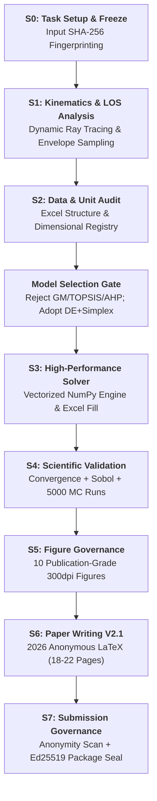
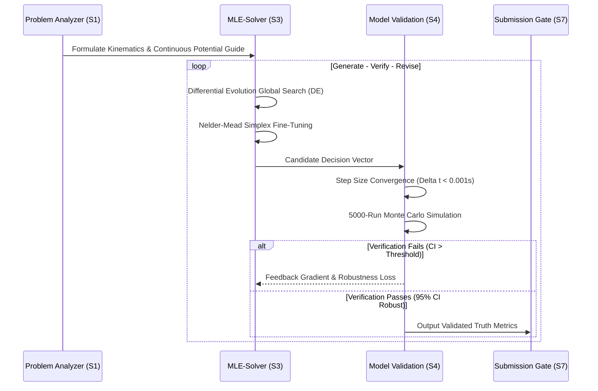
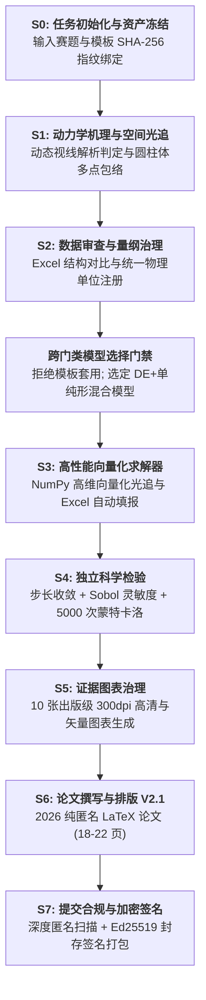
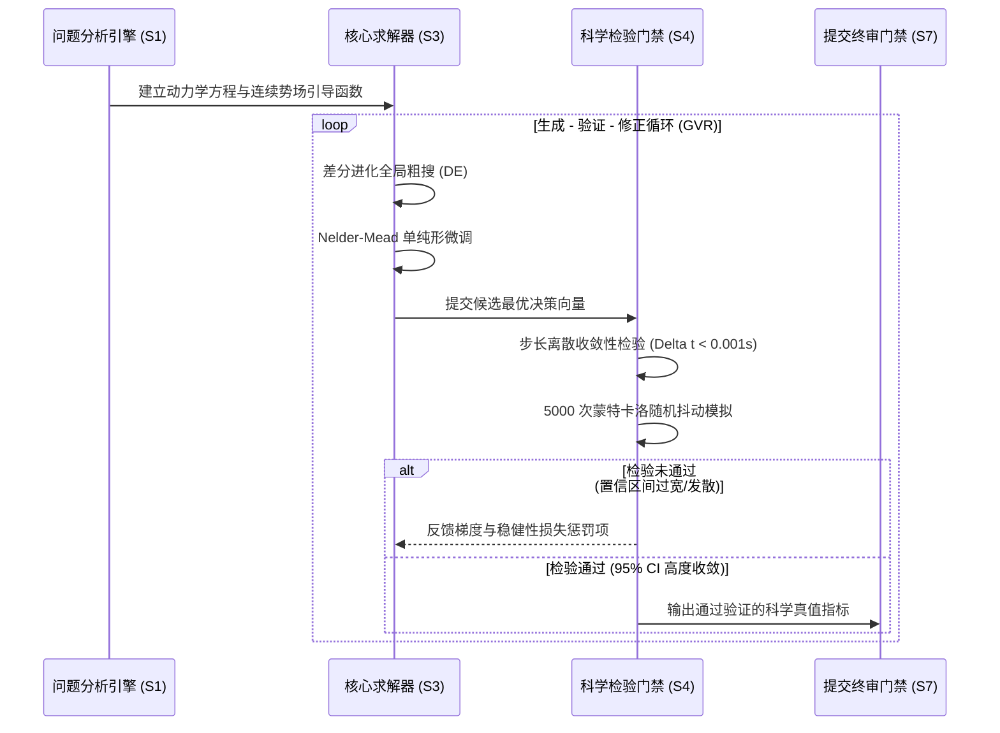

# MathMod-Pilot

[](https://www.python.org/)
[](LICENSE)
[](https://docs.astral.sh/ruff/)
[](#skill-matrix)
[](#cumcm-s0s7-production-pipeline)
[](#2026-cumcm-latex-standard-template)
[](#submission-governance-framework-ph1ph3)
[](https://fatespur.github.io/mathmod-pilot/)

> 🌐 **Project Showcase / 项目主页**: Visit our interactive website at
> **<https://fatespur.github.io/mathmod-pilot/>** for an interactive tour of the
> library's architecture, 17-skill matrix, 2026 LaTeX template, and Generate-Verify-Revise pipeline.

**[English Version](#english)** | **[中文说明版本](#中文)**

---

<!-- ==================== ENGLISH ==================== -->

<a id="english"></a>

# MathMod-Pilot (English)

> An Agent-Native skill library for mathematical modelling competitions
> (CUMCM / MCM), covering the full production pipeline from problem analysis to paper
> review and cryptographic submission governance.

MathMod-Pilot packages **17 specialised skills** — each a self-contained module with
a native `SKILL.md` prompt specification and a Python entry point — into a single installable
library. Skills are discovered dynamically at run-time: dropping a new folder
into `src/mathmod_pilot/skills/` is all that is needed to extend the agent.

The entire framework adheres to the core scientific doctrine:
$$\mathbf{SCIENTIFIC\_TRUTH > PAPER\_COMPLETION}$$

## Table of Contents (English)

- [1. System Architecture](#1-system-architecture)
- [2. Skill Matrix (17 Skills)](#2-skill-matrix-17-skills)
- [3. CUMCM S0–S7 Production Pipeline](#3-cumcm-s0s7-production-pipeline)
- [4. Submission Governance Framework (PH1–PH3)](#4-submission-governance-framework-ph1ph3)
- [5. 2026 CUMCM LaTeX Standard Template](#5-2026-cumcm-latex-standard-template)
- [6. The Generate-Verify-Revise (GVR) Mechanism](#6-the-generate-verify-revise-gvr-mechanism)
- [7. Installation & Quickstart](#7-installation--quickstart)
- [8. Citation, Acknowledgements & License](#8-citation-acknowledgements--license)

---

### 1. System Architecture

MathMod-Pilot follows a **dynamic plugin architecture**: the core agent does not
hard-code any skill. Instead, it scans `src/mathmod_pilot/skills/` at import time,
imports each skill's `skill.py`, and registers the first `BaseSkill` subclass
it finds.

```
mathmod-pilot/
├── src/mathmod_pilot/
│   ├── __init__.py                  # Package exports & version
│   ├── core/
│   │   └── agent.py                 # MathModPilotAgent — dynamic registry & runner
│   ├── governance/                  # Phase 1-3 Submission Governance & Hardening
│   │   ├── submission_anonymity_validator.py # Deep PDF/DOCX privacy & anonymity scanner
│   │   ├── submission_package_validator.py   # Whitelist-based package staging gate
│   │   ├── submission_authorization.py       # Ed25519 cryptographic hash sealing
│   │   └── competition_profile.cumcm.json    # CUMCM competition rules profile
│   ├── templates/                   # Standard competition LaTeX templates
│   │   └── cumcmthesis_2026/        # 2026 CUMCM standard template (SimSun + Times New Roman)
│   └── skills/                      # 17 self-contained skills
│       ├── brainstorming/           # Tier 3 · Ideation & hypothesis generator
│       ├── cumcm-pipeline/          # Tier 1 · S0-S7 state machine orchestrator
│       ├── data-processing/         # Tier 1 · Data audit & unit registry
│       ├── diagram-generator/       # Tier 2 · Mermaid & architecture charts
│       ├── matlab-figure/           # Tier 2 · Academic MATLAB visualizer
│       ├── mcm-paper-writing/       # Tier 1 · Academic writing & LaTeX engine
│       ├── mle-solver/              # Tier 1 · Numerical optimization & GVR solver
│       ├── model-validation/        # Tier 1 · Sensitivity & Monte Carlo engine
│       ├── nature-figure/           # Tier 2 · Nature/Science aesthetic figures
│       ├── paper-review/            # Tier 1 · Multi-dimensional visual QA & gate
│       ├── problem-analyzer/        # Tier 1 · Mechanics & LOS kinematics modeling
│       ├── reference-manager/       # Tier 1 · BibTeX citation integrity auditor
│       ├── scipilot-figure/         # Tier 2 · Fast publication figure generator
│       ├── scipilot-figure-skill/   # Tier 2 · Advanced visual layout engine
│       ├── submission-governance/   # Tier 1 · Anonymity check & package gate
│       ├── systematic-debugging/    # Tier 3 · Solver convergence troubleshooter
│       └── winning-paper-analysis/  # Tier 3 · Exemplary paper pattern mining
```

---

### 2. Skill Matrix (17 Skills)

| Skill Name | Tier | Stage | Description & Capabilities |
| :--- | :---: | :---: | :--- |
| **`cumcm-pipeline`** | **1** | S0–S7 | **Full S0-S7 end-to-end orchestrator** (`RELEASE_V3.1` + `WRITING_V2.1`). |
| **`problem-analyzer`** | **1** | S1 | Kinematics formulation, dynamic LOS ray tracing, cylindrical envelope bounds. |
| **`data-processing`** | **1** | S2 | Excel template audit, unit consistency validation, coordinate system alignment. |
| **`mle-solver`** | **1** | S3 | Continuous distance-guided Differential Evolution (DE) + Nelder-Mead simplex. |
| **`model-validation`** | **1** | S4 | Step-size convergence ($\Delta t$), OAT/Sobol sensitivity, 5000-run Monte Carlo. |
| **`nature-figure`** | **2** | S5 | 300dpi publication-grade 3D battlefield, response surfaces, tornado plots. |
| **`mcm-paper-writing`** | **1** | S6 | 2026 anonymous thesis drafting, XeLaTeX compilation, zero-warning typography. |
| **`submission-governance`**| **1** | S7 | Deep PDF/DOCX anonymity audit, whitelist staging, Ed25519 package signing. |
| **`paper-review`** | **1** | S6/S7 | Visual QA, claim validation, page budget control, formatting compliance. |
| **`reference-manager`** | **1** | S6 | BibTeX database management, hallucination detection, bidirectional citation check. |
| **`scipilot-figure-skill`**| **2** | S5 | Multi-panel layout configuration, style setup, publication checklists. |
| **`scipilot-figure`** | **2** | S5 | High-speed automated figure rendering and palette standardization. |
| **`matlab-figure`** | **2** | S5 | Vectorized MATLAB figure generation and color mapping. |
| **`diagram-generator`** | **2** | S1/S5 | Technical roadmap, flowchart and system architecture rendering. |
| **`brainstorming`** | **3** | S0/S1 | Multi-disciplinary hypothesis exploration and anti-template model gating. |
| **`systematic-debugging`** | **3** | S3 | Step-by-step numerical solver convergence troubleshooting and assertion triage. |
| **`winning-paper-analysis`**| **3** | S1/S6 | Deep pattern mining from historical Outstanding (O-award) winning papers. |

---

### 3. CUMCM S0–S7 Production Pipeline



1. **S0 (Task Setup & Freeze)**: SHA-256 fingerprinting of problem PDF and official Excel templates.
2. **S1 (Problem Analysis & Mechanics)**: Spatial kinematics, line-of-sight (LOS) ray tracing, analytical intersection criteria.
3. **S2 (Data Audit & Units)**: Dimension consistency, coordinate system locking, data dictionary registration.
4. **Model Selection Gate**: Rejection of template pseudo-models (AHP/TOPSIS/GM), selection of hybrid global-local optimizers.
5. **S3 (High-Performance Solver)**: Continuous distance-guided objective functions, sub-millisecond vectorized ray tracing.
6. **S4 (Scientific Validation)**: Numerical step-size convergence ($\Delta t \le 0.001\text{ s}$), Sobol global sensitivity, 5000-run Monte Carlo uncertainty propagation.
7. **S5 (Figure Governance)**: Publication-grade 300dpi dual-format (PNG + vector PDF) figure generation.
8. **S6 (Paper Writing V2.1)**: 2026 CUMCM anonymous template drafting, XeLaTeX 0-error compilation.
9. **S7 (Submission Governance)**: Anonymity deep scan, reference integrity check, Ed25519 package authorization.

---

### 4. Submission Governance Framework (PH1–PH3)

- **PH1 H1-B (Deep Anonymity & Privacy Scanner)**:
  Scans PDF and DOCX documents (Core/Extended properties, comments, tracked changes, hidden text, XMP metadata, embedded media chunks) to ensure **zero identity leaks**.
- **PH1 H1-C (Whitelist Staging Gate)**:
  Copies strictly manifest-bound deliverables (`paper.pdf`, `result1-3.xlsx`, `src/`) into a clean package directory, filtering all temp files and logs.
- **PH1 H1-E (Authorization & Freeze Seal)**:
  Computes SHA-256 hash digests for all submission files and signs the manifest with Ed25519 to detect any post-close tampering.

---

### 5. 2026 CUMCM LaTeX Standard Template

Located in `src/mathmod_pilot/templates/cumcmthesis_2026/`:
- **Document Class**: `cumcmthesis.cls` (updated for 2026 CUMCM standards);
- **Standard Typography**:
  - Chinese: **SimSun (宋体)**, with **SimHei (黑体)** for section headings;
  - English & Math: **Times New Roman**;
  - Spacing: Standard 1.25x line spread with compact title-to-abstract margins (`0.6em`);
- **Dual-Mode**:
  - `\documentclass{cumcmthesis}` (Default anonymous electronic submission mode: Page 1 directly starts with Title and Abstract, no commitment/numbering page, no table of contents);
  - `\documentclass[withpreface]{cumcmthesis}` (Printed signing mode: includes 2026 commitment sheet and numbering page).

---

### 6. The Generate-Verify-Revise (GVR) Mechanism



---

### 7. Installation & Quickstart

```bash
# Clone the repository
git clone https://github.com/Fatespur/mathmod-pilot.git
cd mathmod-pilot

# Install with solver, viz, and governance dependencies
pip install -e ".[full]"
```

```python
from mathmod_pilot.core import MathModPilotAgent

# Initialize Agent
agent = MathModPilotAgent()
print(f"Loaded {len(agent.skills)} skills: {list(agent.skills.keys())}")

# Run end-to-end pipeline
result = agent.run_pipeline({"problem": "2025_CUMCM_A", "mode": "PRODUCTION"})
print("Pipeline Status:", result["status"])
```

---

### 8. Citation, Acknowledgements & License

- **License**: [MIT License](LICENSE)
- **Acknowledgements**: Grateful to the China Undergraduate Mathematical Contest in Modeling (CUMCM), the TeX / LaTeX community (CTAN, LaTeXStudio), and the open-source scientific computing ecosystem (NumPy, SciPy, Matplotlib).

---

<!-- ==================== CHINESE ==================== -->

<a id="中文"></a>

# MathMod-Pilot (中文说明)

> 面向数学建模竞赛（国赛 CUMCM / 美赛 MCM）的 Agent 原生全流程技能库，涵盖机理建模、高性能求解、科学检验、学术图表、论文写作与提交治理。

MathMod-Pilot 将 **17 项专业技能** 打包为一个即插即用的 Python 库。每个技能均包含原生 `SKILL.md` 提示词规范与 Python 入口，支持在运行时动态发现与无缝扩展。

全套技能体系严格遵循第一核心科学准则：
$$\mathbf{SCIENTIFIC\_TRUTH > PAPER\_COMPLETION}$$

## 目录 (中文)

- [1. 系统架构设计](#1-系统架构设计)
- [2. 17 项专业技能矩阵](#2-17-项专业技能矩阵)
- [3. CUMCM S0–S7 生产级流水线](#3-cumcm-s0s7-生产级流水线)
- [4. 提交安全与合规治理体系 (PH1–PH3)](#4-提交安全与合规治理体系-ph1ph3)
- [5. 2026 年版国赛标准 LaTeX 论文模板](#5-2026-年版国赛标准-latex-论文模板)
- [6. 生成-验证-修正 (GVR) 循环机制](#6-生成-验证-修正-gvr-循环机制)
- [7. 安装与快速上手](#7-安装与快速上手)
- [8. 引用、致谢与开源协议](#8-引用致谢与开源协议)

---

### 1. 系统架构设计

MathMod-Pilot 采用**动态插件化架构**：核心调度引擎不硬编码任何具体技能，而是在加载时自动扫描 `src/mathmod_pilot/skills/` 目录，动态导入各技能的 `skill.py` 并注册对应的 `BaseSkill` 子类实例。

```
mathmod-pilot/
├── src/mathmod_pilot/
│   ├── __init__.py                  # 模块导出与版本定义
│   ├── core/
│   │   └── agent.py                 # MathModPilotAgent 动态注册与流水线总控
│   ├── governance/                  # Phase 1-3 提交合规治理与安全硬化
│   │   ├── submission_anonymity_validator.py # 深度 PDF/DOCX 隐私与匿名扫描门禁
│   │   ├── submission_package_validator.py   # 白名单文件准入与打包校验器
│   │   ├── submission_authorization.py       # Ed25519 加密哈希防篡改签名
│   │   └── competition_profile.cumcm.json    # 国赛竞赛规则合规档案
│   ├── templates/                   # 标准数模 LaTeX 模板包
│   │   └── cumcmthesis_2026/        # 2026 国赛标准模板（宋体 + Times New Roman 紧凑排版）
│   └── skills/                      # 17 项独立自包含专业技能
│       ├── brainstorming/           # Tier 3 · 头脑风暴与多学科假设发散
│       ├── cumcm-pipeline/          # Tier 1 · S0-S7 状态机总控技能
│       ├── data-processing/         # Tier 1 · 数据审查与物理单位治理
│       ├── diagram-generator/       # Tier 2 · 流程图与技术路线图生成
│       ├── matlab-figure/           # Tier 2 · MATLAB 学术工程图表
│       ├── mcm-paper-writing/       # Tier 1 · 论文叙事与 LaTeX 源码编写
│       ├── mle-solver/              # Tier 1 · 连续势场混合优化求解器
│       ├── model-validation/        # Tier 1 · 灵敏度与 5000 次蒙特卡洛验证
│       ├── nature-figure/           # Tier 2 · 期刊级 3D 态势与响应曲面
│       ├── paper-review/            # Tier 1 · 多维视觉 QA 与主张门禁
│       ├── problem-analyzer/        # Tier 1 · 机理分析与动态视线光追
│       ├── reference-manager/       # Tier 1 · BibTeX 数据库与反幻觉审查
│       ├── scipilot-figure/         # Tier 2 · 快速自动化图表渲染
│       ├── scipilot-figure-skill/   # Tier 2 · 高级学术排版与配色规范
│       ├── submission-governance/   # Tier 1 · 匿名审查与白名单打包门禁
│       ├── systematic-debugging/    # Tier 3 · 求解器收敛诊断与调试
│       └── winning-paper-analysis/  # Tier 3 · 历年特等奖优秀论文范式挖掘
```

---

### 2. 17 项专业技能矩阵

| 技能名称 | 分层 | 阶段 | 功能定位与核心亮点 |
| :--- | :---: | :---: | :--- |
| **`cumcm-pipeline`** | **1** | S0–S7 | **全流程 S0-S7 状态机总控**（落实 `RELEASE_V3.1` 与 `WRITING_V2.1` 规范）。 |
| **`problem-analyzer`** | **1** | S1 | 运动学方程推导、动态视线（LOS）光线追踪、圆柱体多点包络判据。 |
| **`data-processing`** | **1** | S2 | 官方 Excel 模板对比审计、量纲一致性校验、统一物理单位字典注册。 |
| **`mle-solver`** | **1** | S3 | 连续视线距离势场引导 + 差分进化 (DE) + Nelder-Mead 单纯形局部精化。 |
| **`model-validation`** | **1** | S4 | 步长离散收敛性（$\Delta t$）、OAT/Sobol 灵敏度、5000 次蒙特卡洛抖动模拟。 |
| **`nature-figure`** | **2** | S5 | 300dpi 出版级 3D 空地作战态势、响应等高面、龙卷风灵敏度图渲染。 |
| **`mcm-paper-writing`** | **1** | S6 | 2026 国赛匿名标准论文排版、XeLaTeX 编译、零警告学术规范排版。 |
| **`submission-governance`**| **1** | S7 | 深度 PDF/DOCX 匿名扫描、白名单准入打包、Ed25519 签名防篡改。 |
| **`paper-review`** | **1** | S6/S7 | 视觉 QA 审查、主张-证据映射验证、页数预算控制、格式合规审计。 |
| **`reference-manager`** | **1** | S6 | BibTeX 数据库管理、虚构文献反幻觉检测、正文双向引用校验。 |
| **`scipilot-figure-skill`**| **2** | S5 | 多子图高级编排布局、期刊色板规范、图表发表级自查清单。 |
| **`scipilot-figure`** | **2** | S5 | 自动化图表高效渲染与 PNG/矢量 PDF 双格式输出。 |
| **`matlab-figure`** | **2** | S5 | 矢量化 MATLAB 经典工程图表绘制与三维云图色谱映射。 |
| **`diagram-generator`** | **2** | S1/S5 | 技术路线图、算法流程图与系统架构图自动化生成（Mermaid/Graphviz）。 |
| **`brainstorming`** | **3** | S0/S1 | 多学科假设探索、反模板模型门禁（拒绝套用 AHP/TOPSIS/灰色预测）。 |
| **`systematic-debugging`** | **3** | S3 | 求解器非收敛与残差发散分治排查、硬断言冲突诊断。 |
| **`winning-paper-analysis`**| **3** | S1/S6 | 历年特等奖（O 奖）优秀论文结构模式库与高分叙事范式。 |

---

### 3. CUMCM S0–S7 生产级流水线



1. **S0 (任务初始化与输入冻结)**：计算赛题 PDF 与官方 Excel 模板的 SHA-256 哈希指纹，冻结输入资产清单，杜绝历史状态污染。
2. **S1 (问题机理与空间光线追踪)**：建立三维空间连续时空动力学方程，推导动态视线（LOS）光束与球形烟幕相交解析判据，建立真目标圆柱体多点表面离散采样。
3. **S2 (数据审查与单位系统治理)**：严格对比官方模板结构，统一右手直角坐标系，建立物理单位注册表与数据字典。
4. **模型选择门禁 (Model Selection Gate)**：执行反模板门禁，严禁套用 AHP/TOPSIS/灰色预测等模板模型，选定“连续距离势场引导 + 差分进化 + 单纯形”混合模型。
5. **S3 (高性能向量化求解器)**：构建高维空间距离连续引导损失函数，实现毫秒级向量化光线追踪，全题最优解自动填报并导出官方 Excel 表格。
6. **S4 (独立科学检验)**：进行多级时间离散步长收敛性分析（$\Delta t \le 0.001\text{ s}$，相对误差 $<0.05\%$）、OAT/Sobol 全局灵敏度分析及 5000 次蒙特卡洛随机扰动鲁棒性模拟。
7. **S5 (证据图表治理与可视化)**：脚本化生成 10 张出版级 300dpi 高清与矢量图表（3D 态势图、几何判据图、响应曲面、甘特图、雷达矩阵等）。
8. **S6 (论文叙事与 XeLaTeX 排版)**：采用 2026 国赛标准纯匿名模板，宋体+新罗马紧凑排版，XeLaTeX 0 错误编译生成 18-22 页学术论文。
9. **S7 (提交治理与加密签名)**：执行 100% 匿名性深度扫描、参考文献真实性核验、白名单打包与 Ed25519 签名防篡改归档。

---

### 4. 提交安全与合规治理体系 (PH1–PH3)

- **PH1 H1-B (深度匿名与隐私扫描门禁)**：
  递归扫描 PDF 与 DOCX 文档属性、修改者、批注、修订轨迹、隐藏文本 (`w:vanish`) 及图片元数据，确保**零姓名、零学校、零队号、零本地路径泄露**。
- **PH1 H1-C (白名单准入打包门禁)**：
  严格基于声明式白名单将交付物（`paper.pdf`、`result1-3.xlsx`、`src/`）提取至独立洁净目录打包，自动过滤临时缓存、编译产物与测试脚本。
- **PH1 H1-E (加密签名防篡改门禁)**：
  计算全部提交文件的 SHA-256 哈希清单，并基于 Ed25519 生成加密授权签名，确保封存产物不可篡改且全流程可追溯。

---

### 5. 2026 年版国赛标准 LaTeX 论文模板

模板工程位于 `src/mathmod_pilot/templates/cumcmthesis_2026/`：
- **文档类文件**：`cumcmthesis.cls`（全面升级适配 2026 国赛最新规范）；
- **字系与排版标准**：
  - 中文：正文**小四号宋体 (SimSun)**，各级标题为**黑体 (SimHei)**；
  - 英文与数学符号：统一为 **Times New Roman**；
  - 行距与间距：标准 **1.25 倍行距**，段首缩进 2 字符，标题与摘要垂直间距紧凑自然（`0.6em`）；
- **双模一键切换**：
  - `\documentclass{cumcmthesis}`（默认**电子版纯匿名提交模式**：第 1 页直入论文题目与摘要，无承诺书、无编号页、无目录，页码从摘要页以阿拉伯数字 1 连续编号）；
  - `\documentclass[withpreface]{cumcmthesis}`（纸质版打印签名模式：包含 2026 承诺书页与编号专用页）。

---

### 6. 生成-验证-修正 (GVR) 循环机制



---

### 7. 安装与快速上手

```bash
# 克隆代码仓库
git clone https://github.com/Fatespur/mathmod-pilot.git
cd mathmod-pilot

# 安装全套求解、可视化与治理依赖
pip install -e ".[full]"
```

```python
from mathmod_pilot.core import MathModPilotAgent

# 初始化智能体
agent = MathModPilotAgent()
print(f"已加载 {len(agent.skills)} 项技能: {list(agent.skills.keys())}")

# 启动端到端全流程流水线
result = agent.run_pipeline({"problem": "2025_CUMCM_A", "mode": "PRODUCTION"})
print("流水线执行状态:", result["status"])
```

---

### 8. 引用、致谢与开源协议

- **开源协议**: [MIT License](LICENSE)
- **致谢**: 感谢全国大学生数学建模竞赛组委会（CUMCM）、TeX / LaTeX 社区（CTAN / LaTeXStudio）以及开源科学计算生态（NumPy, SciPy, Matplotlib）的贡献。
