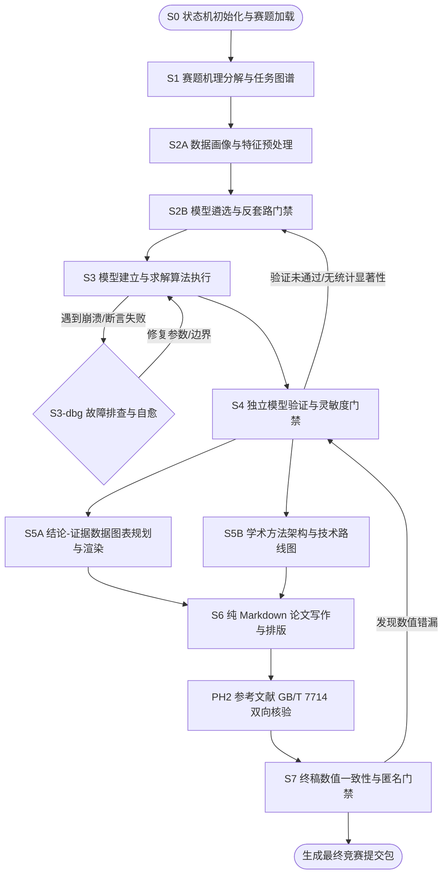

# CUMCM 数学建模全生命周期与门禁规则

## 1. 建模工作流全景图 (Lifecycle Overview)

---

## 2. 各阶段关键门禁准则 (Stage Quality Gates)

### Gate 1: S1 -> S2B 结构完备性门禁
- 必须明确给出每个问题的变量符号、物理量纲（Units）、可调参数与客观约束；
- 必须导出 `hard_assertions.json`，定义解的物理可行域（例如速度不可为负、资源不可超限）。

### Gate 2: S2B -> S3 模型可行性门禁 (Anti-Template Gate)
- 严禁空泛套用高阶名词；必须给出模型选择的科学依据与可识别性（Identifiability）论证；
- 必须同时指定至少一个基准对照模型（如线性模型或简单启发式），用于 S4 验证阶段做提升对比。

### Gate 3: S3 -> S4 算法收敛与断言门禁
- 算法求解日志必须记录收敛轨迹；
- 必须通过 `hard_assertions.json` 中定义的所有物理硬断言。若违背，自动触发 `systematic-debugging`。

### Gate 4: S4 -> S5/S6 科学放行门禁 (Validation Gate)
- **基线超越检验**：主选模型的精度或目标函数提升必须在统计学上显著优于基准模型；
- **参数灵敏度检验**：在核心参数浮动 ±10% 时，模型解的漂移应在合理安全包络线内；
- **鲁棒性压力测试**：对于含噪声的数据输入，评估求解结果的崩溃点（Breakdown point）。

### Gate 5: S6 -> S7 论文合规与匿名门禁
- **纯 Markdown 原生公式**：严禁提交未转换的 LaTeX 碎片，公式必须在 Word OMML 转换中保持原生可编辑；
- **无目录准则**：严格遵守全国大学生数学建模竞赛组委会规则，严禁生成目录；
- **绝对匿名准则**：严禁出现参赛队员姓名、高校名称、指导教师信息或个人主目录路径。
